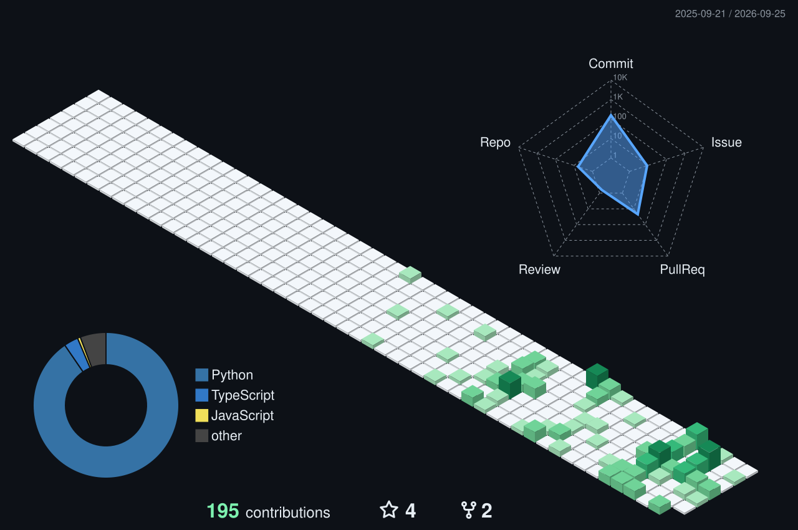

  

  <h2>About Me</h2>
  
I&#x27;m a full-stack and AI developer. I like building the whole thing: the interface people use, the systems behind it, and the intelligence that makes it useful. My goal is to create software that changes the world, one real problem at a time.

  
I also build silly, occasionally stupid things just because they&#x27;re fun. Curiosity starts most of my projects; getting them to actually work is the part I love most.

  <h2>GitHub Analytics</h2>
  

  

  <h2>Projects</h2>
  
<strong>♻️ <a href="https://github.com/khanhtuongnakitomo/GreenGuard26">GreenGuard26</a></strong> · Computer vision · Edge AI 
  A recycling kiosk connecting material detection, machine control, a dashboard, and rewards.

  
<strong>🏮 <a href="https://github.com/BennedictQuanTon/Team-Develarper---AssemblyAI---Voice-Agent-Hackathon">The Lantern</a></strong> · Voice AI · Team project 
  A multilingual restaurant voice service with local AI and a kitchen order workflow.

  
<strong>♿ <a href="https://github.com/shynnguyen1004/EnableCode-FrontEnd">Enable Code</a></strong> · Accessibility · Team project 
  Block-based coding lessons controlled through webcam face gestures.

  
<strong>🌦️ <a href="https://github.com/khanhtuongnakitomo/WeatherRise-2026">WeatherRise / Weatherise</a></strong> · AI agents · Team project 
  Weather-aware planning for tourism, construction, and agriculture.

  
Also explored: <a href="https://github.com/khanhtuongnakitomo/ScheduleAI">ScheduleAI</a>, <a href="https://github.com/khanhtuongnakitomo/gdgoc-hackaphobia-roomie">Roomie</a>, GreenPoint, and Aurelia (in planning).

  <h2>Tech Stack</h2>
  
<strong>Languages</strong> 
    

  
<strong>Frontend</strong> 
   

  
<strong>Backend & data</strong> 
      

  
<strong>AI & edge</strong> 
      

  
<strong>Tools</strong> 
    

