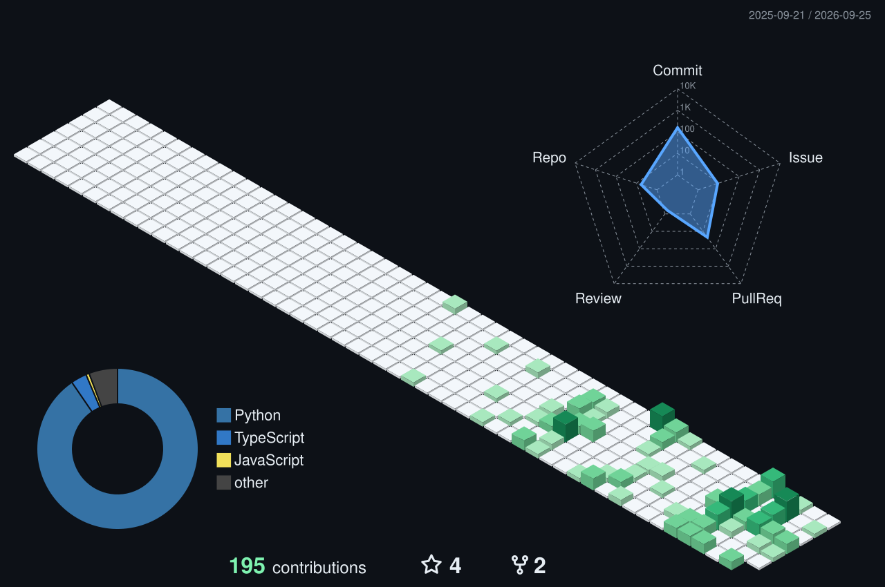

  

<strong>Full-stack development · Applied AI · Accessible interfaces</strong>

I build software that connects useful interfaces with reliable systems behind them: voice agents, accessible learning tools, recycling workflows, and personal planning apps. I work across frontend, backend, and AI integration, and I enjoy the testing and debugging that turn an idea into something usable.

Some projects are my own; others are collaborations. The entries below distinguish the project from my contribution and link to code, demos, or representative changes.

## Selected projects

### GreenGuard26 — Computer vision for recycling

A recycling kiosk project connecting material detection, machine workflows, an operations dashboard, and rewards.

- **My work:** detection runtime organization, training pipeline corrections, validation tools, and dashboard changes.
- **Technology:** Python, computer vision, ONNX, Jetson deployment, and web interfaces.
- **Evidence:** [PC and Jetson runtime reorganization](https://github.com/khanhtuongnakitomo/GreenGuard26/pull/23) · [Model 1-B tester](https://github.com/khanhtuongnakitomo/GreenGuard26/commit/e52b1d4413f187a015ac1cd10b0f47b88e966496).

[Repository](https://github.com/khanhtuongnakitomo/GreenGuard26) · [Technical documentation](https://github.com/khanhtuongnakitomo/GreenGuard26/blob/main/DOCUMENTATION.md)

### The Lantern — Restaurant voice agent

A team project for the AssemblyAI Voice Agent Hackathon. Guests speak to a table device; the system interprets requests, validates order changes, and coordinates with the kitchen.

- **My work:** V2 architecture integration, persistent order revisions, kitchen workflow integration, and fixes for quantity changes and saved-order readback.
- **Technology:** Python, React, TypeScript, WebSockets, AssemblyAI, local LLMs, and SQLite.
- **Evidence:** [V2 architecture and workflow integration](https://github.com/BennedictQuanTon/The-Lantern-AssemblyAI-Voice-Agent-Hackathon/pull/32) · [Order-edit and readback fixes](https://github.com/BennedictQuanTon/The-Lantern-AssemblyAI-Voice-Agent-Hackathon/pull/49).
- **Implementation:** the repository preserves multiple versions; the order-edit fixes are in the `feature/lantern-waiter` branch history.

[My fork](https://github.com/khanhtuongnakitomo/The-Lantern) · [Team repository](https://github.com/BennedictQuanTon/The-Lantern-AssemblyAI-Voice-Agent-Hackathon) · [Order-edit implementation branch](https://github.com/khanhtuongnakitomo/The-Lantern/tree/feature/lantern-waiter)

### Enable Code — Accessible programming education

A team-built platform that combines webcam face and eye controls with Blockly lessons, progress tracking, and an authentication backend.

- **My work:** frontend code-generation corrections and backend contributions, including transactional email fixes and documentation.
- **Technology:** React, TypeScript, Blockly, MediaPipe, Express, MongoDB, and ONNX.
- **Evidence:** [Ignore orphan blocks when generating Python](https://github.com/shynnguyen1004/EnableCode-FrontEnd/pull/22).
- **Source visibility:** the frontend is public; the backend is private.

[My frontend fork](https://github.com/khanhtuongnakitomo/EnableCode-FrontEnd) · [Team frontend](https://github.com/shynnguyen1004/EnableCode-FrontEnd) · [Demo](https://enablecode.vercel.app)

### ArchitectureLab — Human-approved agent tools

A team-built architecture studio where a person and an AI agent share a system model. The agent can inspect a selected flow, simulate a failure, and propose a patch for a person to approve.

- **My work:** stale-revision protection, patch validation, scoped flow-selection checks, and regression coverage.
- **Technology:** React, TypeScript, Vite, and WebMCP.
- **Evidence:** [Revision and patch-safety changes](https://github.com/UniverseScripts/webmcp/pull/2).

[My fork](https://github.com/khanhtuongnakitomo/ArchitectureLab-WebMCP) · [Team repository](https://github.com/UniverseScripts/webmcp) · [Demo](https://architecturelab.vercel.app)

### WeatherRise / Weatherise — Weather-aware planning

A team project combining weather information and AI agents for tourism, construction, and agriculture planning.

- **My work:** intelligence-layer changes, LLM parsing, multiple-source integration, and Vietnamese response support.
- **Technology:** Python, LangGraph, retrieval, external data integrations, and a web frontend.
- **Evidence:** [Intelligence layer](https://github.com/khanhtuongnakitomo/WeatherRise-2026/pull/23) · [LLM parser](https://github.com/khanhtuongnakitomo/WeatherRise-2026/pull/27) · [Multiple sources](https://github.com/khanhtuongnakitomo/WeatherRise-2026/pull/30).

[Repository](https://github.com/khanhtuongnakitomo/WeatherRise-2026)

### Roomie — Roommate and rental matching

A team-built platform for Vietnamese students, with roommate matching, rental listings, semantic search, and chat.

- **My work:** backend router refactoring.
- **Technology:** FastAPI, React, Firebase, Firestore, and Vertex AI embeddings.
- **Evidence:** [Backend router contribution](https://github.com/UniverseScripts/gdgoc-hackaphobia-roomie/commit/c73067d1ef76d17da06f0bb762eacebac0150e4b).

[My fork](https://github.com/khanhtuongnakitomo/gdgoc-hackaphobia-roomie) · [Team repository](https://github.com/UniverseScripts/gdgoc-hackaphobia-roomie) · [Demo](https://hackaphobia-roomie.web.app/)

## More projects

| Project | Focus | Code and evidence |
| --- | --- | --- |
| **LegalIR Hybrid RAG** | Vietnamese legal information retrieval using dense retrieval, BM25, reciprocal rank fusion, and reranking. | [Repository](https://github.com/khanhtuongnakitomo/RAG_ROI_UIT-DSC_TASK_1) |
| **ScheduleAI** | A working HTML/CSS/JavaScript prototype with connected calendar, schedule, timer, notes, and progress blocks. | [Repository](https://github.com/khanhtuongnakitomo/ScheduleAI) |
| **Develarper — AMD AI Hackathon** | A team agent project combining local model inference, deterministic handlers, and remote API routing. My contributions include prompt changes and documentation updates. | [My fork](https://github.com/khanhtuongnakitomo/Develarper-AMD-Agent) · [Team repository](https://github.com/UniverseScripts/develarper) · [Prompt contribution](https://github.com/UniverseScripts/develarper/commit/920951a1d8634b2d353fcb82d04c2b0b74d359e8) |

## Projects with private source

These projects have implementation work, but their source repositories are currently private.

| Project | Implemented work | Current scope |
| --- | --- | --- |
| **Aurelia** | Personal planning workspace with schedules, tasks, rich notes, search, preferences, and backup. React/TypeScript frontend, Fastify API, and PostgreSQL storage. | Working app under development. AI planning, proactive reminders, and voice calls remain future work. |
| **GreenPoint** | Recycling rewards frontend and backend. My changes include QR claim and reward UI fixes, plus backend CORS corrections for the deployed frontend. | Team project; distinct from the GreenGuard26 kiosk and connected to its recycling ecosystem. [Frontend demo](https://frontend-green-point.vercel.app) |
| **Workflow Crystal** | Versioned workflow package for Codex and Cursor, with skills, role definitions, guarded installation, and portable handoff scripts. | Developer tooling; prepared, installed, and behaviorally verified states are tracked separately. |
| **Web Assessment — UTS** | Earlier HTML/CSS coursework website with multiple pages and a gallery. | Coursework project. |

## Tools I use

| Area | Technologies |
| --- | --- |
| Languages | Python, TypeScript, JavaScript |
| Interfaces | React, React Native / Expo, Vite, HTML, CSS |
| APIs and data | FastAPI, Fastify, Express, PostgreSQL, SQLite, MongoDB, Firebase |
| AI and computer vision | PyTorch, OpenCV, ONNX, Ollama, retrieval pipelines, NVIDIA Jetson |
| Engineering | Git, WebSockets, automated tests, benchmark scripts, deployment tooling |

## GitHub activity

  

  

